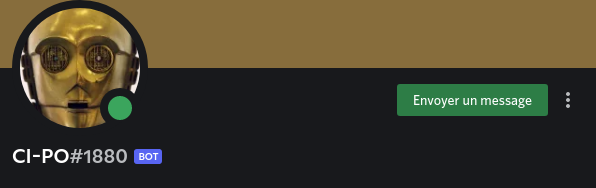

<br>

# [](https://cercle-informatique.be) CI-PO (Cerk Info Program Organization)

CI-PO est un robot Discord proposé par le **Cerkinfo A.S.B.L**. Son but est d'aider à la gestion des différents tâche des cercles, en optimisant les commandes, le traitement et l'affichage de ceux-ci.

## Table des matières

* Disclaimer
* HOW TO Utilisateur
* HOW TO Developpeur
* License Open Source
* Contact - Report Bug
* Crédit & Historique MAJ

## Disclaimer
1 ) Ce robot est conçu pour gérer les erreurs humaines (pas fait exprès), pas pour gérer les erreurs volontaires de troll. Si le bot bug, il ne sera pas planté pour autant, par contre il est possible que votre configuration soit bugger et que vous deviez TOUT recommencer.

Pas de stress, si vous suivez les demandent du robot scrupuleusement, il n'y aura normalement aucun soucis !
Mais si votre configuration a buggé, contactez la personne de contact mit sur le menu principal, elle vous aidera sous-peu.

(Si vous trollez trop, on aide plus, même si c'est plus une troll-error, tant pis !)

2 ) Dû aux nombreuses opération effectuées en background (en vous épargnant les détails), il se peut que certaines fois le robot se bloque ou ne fait plus rien pendant quelques millisecondes, celà est normal ! Nous vous demandons d'être patient SVP.

Ne ne pouvons malheureusement rien y faire, c'est Discord qui doit gérer des demandes de millairds de robot en même temps et qui ne peut faire toutes les opérations demandé immédiatement...

Si vous ne faites rien d'autres que ce que le robot vous demande, il n'y a aucune chance qu'il soit buggé, il faut juste attendre. Il ne se peut par contre, qu'il soit bloqué plus d'1 minute ! Si c'est le cas, il y a un soucis soit avec le robot en général soit avec Discord. Contactez le responsable mentionné dans la section `Contact - Report Bug`.

## HOW TO Utilisateur
Lors de ce HOW TO nous partirons du principe que vous avez des bases minimum sur l'utilisation de l'application Discord. Si ce n'est le cas, nous vous conseillons de faire quelques recherches et tests en local sur les sujets suivants : La création d'une catégorie et d'un channel écrit, les permissions donné à des personnes et/ou des rôles et la gestion d'un bot Discord.
Pour ce dernier sujet nous vous conseillons de visionner la vidéo suivante : https://youtu.be/LWUmi-5Dybs?t=1360 [visionnez de 22:40 à 23:30]

### Préfixe
Toute commande manuscrite qui est adressé au robot, doit commencer par le préfix `- ` et il ne doit pas y avoir d'espace entre celui-ci et la commande qui suit. 

`Pourquoi ?` Pour éviter que le robot ne surveille tout ce qui est écrit. Lorsque vous commencez votre message par ce préfix, il sait que c'est à lui que vous vous adressez, sinon, il pense que vous parler normalement dans une conversation et ne prête pas attention à ce que vous avez écrit.

### Premier lancement
Lorsque votre channel est créé et configuré correctement, vous allez pouvoir définir le type de gestion que vous souhaitez faire dans cette conversation. 

Tapez la commande : `-gestion [TEMPLATES]`
([TEMPLATES] -> voir section suivante.) 

Le robot ferra quelques manipulations pour initialiser ce dont il a besoin pour son bon fonctionnement et ce sera tout bon ! Vous pouvez à présent utiliser le robot pour votre gestion.

### Templates
Lors de la programmation de CI-PO, il a été fait d'une telle manière que plusieurs "modules" sont disponible sur le même robot. Plutôt qu'avoir un robot pour chaque type de gestion différentes, plusieurs sont disponible sur le même ! Il suffit juste de spécifier quel type de gestion vous souhaitez faire dans quelle conversation (à part exception (ce sera spécifié), il est obligatoire de faire UN type de gestion PAR channel) et ce sera définitif jusqu'à suppression du channel.

Les templates disponible sont les suivant :
[Vous retrouverez le détail de leur fonctionnement et des exemples en cliquant sur celui souhaité]
* [Beer](/templates/Beer/README.md)

/!\ Le nom du templates est aussi le nom que vous devez entrer pour spécifier le type de gestion que vous souhaitez initialiser, vous devez respecter scrupuleusement sa syntaxe tel que noté ci-dessus (majuscule, minuscule, etc)

## HOW TO Developpeur
Lors de ce HOW TO nous considérerons que vous êtes un programmeur Python aguerri ayant connaissance de la Programmation Orienté Objet ainsi que de ses bonnes pratiques. Cependant ce projet étant très intéressant pour un meilleur apprentissage de cette notion de programmation et étant fait par des étudiants pour des étudiants, certains détails seront simplifié ou expliqué pour être accessible à des BA1.
Aussi, il sera supposé que vous avez pris connaissance de la documentation de l'[API Discord](https://discordpy.readthedocs.io/en/latest/api.html), et que vous savez l'utiliser (si ce n'est le cas, nous vous conseillons la vidéo suivante : https://www.youtube.com/watch?v=LWUmi-5Dybs, qui vous expliquera de la création d'un UserBot aux règles de base de la programmation d'un bot Discord).
Si vous souhaitez un peu plus de visuel que ce gros texte ci-dessous, vous pouvez vous appuyer sur le templates `Beer` qui est le tout premier qui a été codé et qui est l'initateur de ce projet. Vous y verrez les critères cité ci-dessous.

### Bot local
Comme vous le savez ou venez de l'apprendre dans la vidéo mentionné ci-dessus, il vous faut une "TOKEN" pour pouvoir utiliser un Bot Discord. La clé ne peut se trouver dans le code Python comme dans la vidéo, pour CI-PO. 
Vous devez installer la librairie `python-dotenv` que vous devez installer au préalable. Ensuitez, créez un fichier `.env` (tel quel, sans nom), entrez-y les lignes suivant :
```
#.env
DISCORD_TOKEN=
```
Et copiez-collez la clé dérrière le `=`, sauvegardez dans le fichier où se trouve le main.py et autres, et vous pouvez à présenter lancer le code CI-PO en local !

### Critères d'éligibilité
CI-PO est un code Orienté Objet Open Source, vous pouvez le copier et le refaire à votre sauce (en ajoutant une référence à ce code) ou proposer des modules à ajouter à cet instance. Car oui, il a été codé pour pouvoir ajouter autant de modules que l'on veut ! Il y a cependant quelques règles à respecter pour être éligible à un être un module CI-PO :
* Codé en Python et respectant les bonnes pratiques de la Programmation Orienté Objet 
* L'optimisation de la tâche **DOIT** se faire via un Message Embed Discord
* Le module n'a pas besoin de réécrire les fonctionnalités des fichier `main.py`&`Gestion.py`.
* Une documentation de son utilisation en Mardown et des exemples en screenshot de son fonctionnement devront être jointe au code (le code commenté est conseillé mais pas obligatoire)
* **L'utilisation doit être au plus simple possible et clair.**
* La gestion d'erreur humaine doit être géré, mais pas la gestion d'erreurs de troll.
* Et évidemment, le module a pour but d'optimiser la tâche que vous avez choisi, il n'a pas pour but de récolter des données ou de surveiller quoi que ce soit, ainsi que de troll ou spam des conversations.

### Pré-requis architectural
Si votre module respecte tous ces critères, il sera lu, testé et ajouté si il est conforme et accepté par le Cerkinfo. Lors de la soumission de votre code nous vous demandons de respecter l'architecture suivante :
* Tout doit être UN dossier nommé au nom de votre module (ce sera ce qu'il faut écrire derrière `-gestion`)
* Dans le dossier se trouvera un fichier __ init __.py
* Il se trouvera également votre fichier principale qui gère tous les sous-objets, nommé scrupuleusement identique au nom du dossier.
* Dans le début de ce fichier principale se trouvera les lignes suivantes :
	- La variable globale 'TEMPLATES_NAME' qui contiendra en string le nom de votre module (ne peut être identique à un autre module)
	- La fonction globale `get()` qui retourne simplement votre Classe mère.
	- Votre classe mère devra avoir dans son espace d'héritage [c'est les ( ) à côté de la déclaration de classe] en premier `commands.Cog`[c'est pour dire à Discord que vous souhaitez être au courant des events] et la variable `name=TEMPLATES_NAME` (tel quel !)
* Vos imports d'objet dans votre dossier seront appelé comme ceci : `from .Objet import Objet` c'est le point devant le premier "Objet" qui est important, il dit à la fonction qui charge les templates automatiquement, qu'elle doit regarder dans votre dossier et non plus haut (là où elle se trouve), sinon ça ne fonctionnera pas.
* Vous pouvez utiliser (ou modifier si cela est vraiment nécessaire)  les objets et fonctions disponible dans le dossier `utils` (ceux-ci ne doivent pas être appelé avec le fameux point)
* Vous devez importer les librairies discord comme ceci :
    `import discord`
    `from discord.ext import commands`

### Pré-requis programmation
Concernant votre Objet qui créera gérera votre Embed Discord, il devra suivre les critères suivants :
* Dans le constructeur se trouvera une variable `self.template = discord.Embed()`. Il sera initialisé dans Gestion.py avec les informations du dictionnaire mentionné ci-dessous.
* Dans le constructeur se trouvera une variable de type dictionnaire avec les clé et valeurs suivantes :
	- str(title) : Le titre de votre Embed
	- str(empty-stock) : Le premier fields dans votre Embed disant qu'il n'a encore rien stocké
	- str(descritpion) : Un petit texte en dessous du titre
	- str(color) : un code couleur en hexadécimal commençant par `0x` au lieu du # habituel
	- str(footer) : un petit texte en bas du Embed
	-  str(thumbnail) : un lien vers une image qui sera en haut à droite de l'Embed

/!\ Toutes ces clés doivent exister ! Mais si vous ne souhaitez pas utiliser l'un de ces espaces, il vous suffit de donner comme valeur un string vide (et None pour la couleur))
* La fonction `startup(self, ctx)` doit exister et fera les dernières initialisation. Elle sera appelée dans Gestion.py lors de la déclaration de votre module pour une conversation.
* La fonction `lock_channel(self, ctx)` doit exister et doit faire les paramétrages de permissions. Elle sera appelée par Gestion.py après la fonction startup.

**Il ne me reste plus qu'à vous souhaiter bon courage et bon amusement !**

## License Open Source
[License MIT Open-Source](LICENSE)

## Contact - Report Bug
Pour toutes questions, rapportage de soucis ou de bug ou pour demander une aide pour installer le bot, veuillez contacter l'email :
    `julien.leclercq@cercle-informatique.be`
    
## Crédit & Historique MAJ
* Project Initiated and First Code by [`None`](mail:julien.leclercq@cercle-informatique.be)