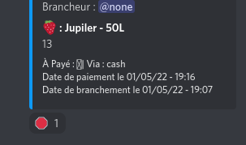

# Beer Templates
Tout premier templates codé pour ce bot gestion, il gère la livraison de fut de bières ou d'autres boissons, le branchement d'un fut (son utilisation quoi) et le retour de vidange. Ces informations sont stocké dans 2 Embed qui dit combien il reste de quoi.

## Sorry
Lors des exemples, là où il y a des émojis sur votre Discord quand vous utilisez le robot, il n'apparaissent pas toujours sur la mienne, il y a un vieux carré barré moche à la place. C'est mon ordi qui a des soucis avec les émojis, toutes mes excuses, ne vous inquiétez pas, en théorie vous n'aurez pas ce problème !

De toute manière, je vous conseil de d'abord lancer ce module dans un channel de test et de réaliser les commandes ci-dessous en temps réel lors de votre lecture, ça vous aidera à ne pas venir consulter ce long HOW TO plus d'une fois ;-) !

(Sorry pour les fautes d'orthographes également, j'ai fait au mieux, si vous en voyez, hésitez pas à signaler ça m'aiderai beaucoup !)

# Table des commandes
* Initialisation
* Livraison
* Branchement
* Vidange
* (Crédits & Historique MAJ)
  

# Initialisation
0) Il faut être Administrateur du serveur pour réaliser cette initialisation.
1) Tout d'abord, il vous faudra créer un nouveau channel vierge avec le nom que vous souhaitez.
2) Tapez la commande `-gestion Beer` et envoyez.

 

3) Le robot va initialiser ses messages tel qu'il en a besoin, ça peut prendre quelques secondes. Attendez qu'il ai réagi avec des émojis au dernier message, celà veut dire qu'il est prêt ! 

 

4) Lors de son initialisation, il aura manipulé quelques permission du channel mais pas celle de la vision de cette conversation. Avant toute chose, veuillez consulter ces permissions et les modifier tel que vous le souhaitez (autoriser la vue uniquement aux barmans & au bureau par exemple, etc...)

5) Il ne vous reste plus qu'à lancer l'une des commandes en réagissant à l'un des émojis ! 

# Livraison

1) Tout d'abord, lancez la livraison en cliquant sur le premier émoji en-dessous du message qui regroupe le stock. Il va alors supprimer ces émojis pour bloquer l'utilisation d'une autre commande au milieu de celle-ci.

2) Un nouveau message va être envoyé par le robot reprenant un menu de bières prédéfini. Vous pouvez choisir la quelle vous venez de reçevoir en cliquant sur le même émoji qui est à côté du nom de la bière, en-dessous.
Si l'une des bières que vous avez acheté ne se trouve pas dedans, cliquez également sur l'émoji "NEW". Vous pourrez les rajouter manuellement juste après. ATTENTION n'oubliez pas de cliquer sur l'émoji VALIDER, une fois votre choix fait ! Sinon rien ne se passe.

 

3) Si vous avez sélectionné l'émoji "NEW", le robot va mettre en pause le précédent menu et va vous en proposer un nouveau pour que vous puissiez rentrer une par une les autre boissons reçues. Il vous demandera d'abord JUSTE le nom (attention ne sera plus modifiable après, soyez sur avant de taper sur Enter !) et ensuite, il demandera JUSTE la quantité (si c'est un nombre à virgule, ne mettez pas une virgule mais un point ! Sinon il buggera et vous devrez recommencer la livraison depuis le début)

 

4) À chaque fois que vous avez entré un nom et une quantité, il supprimera vos réponses textuelles (peu prendre quelques secondes, patientez SVP) et proposera 2 émojis. Il veut savoir si vous souhaitez en ajouter d'autres (cliquez sur l'émoji "PLAY") ou si elles sont toutes là et arrêter l'ajout (cliquez sur l'émoji "STOP").

 

5) Une fois l'ajout de bières fini, les bières sont rajouté au menu principale de Livraison. Il va à présent demander une par une la quantité de fut/bouteilles qui a été réceptionnée. Il modifiera son menu au fur et à mesure, pour celà, il va prendre quelques secondes avant de lancer la question pour la bière suivante, veuillez être patient SVP. 

 

6) Lorsque toutes les quantité ont été ajoutée, il va nettoyer la conversation en enlevant tous les messages textuels (là encore il peut prendre qulques secondes de flottement). Et va vous demander de valider ou annuler cette livraison que vous venez de fournir (Annuler = supprimer le message et retour au point zéro).

 

7) Si vous avez validé, il va faire ses manipulations en ajoutant ces bières dans le menu reprenant les stocks, mettre à jour l'index, supprimer les anciens menu, définir ce message de livraison comme un historique et enfin remettre les émojis de commandes (tout ça prend quelques secondes < 1min). Une fois les émojis présent, le robot est prêt pour de nouvelles commandes !

 

# Branchement
1) Tout d'abord, lancez le branchement en cliquant sur le deuxième émoji en-dessous du message qui regroupe le stock. Il va alors supprimer ces émojis pour bloquer l'utilisation d'une autre commande au milieu de celle-ci.

 

2) Il va alors vous envoyer un nouveau menu vous proposant les différentes boissons présentent dans votre stock. Il vous suffit de sélectionner celle que vous venez de brancher/vendre, en cliquant en-dessous sur le même émoji présent à côté du nom de la boisson. Vous pouvez n'en choisir qu'UNE à la fois (même si vous en sélectionnez plusieurs, il prendra la première sélectionnée dans l'ordre des émojis). ATTENTION n'oubliez pas de cliquer sur l'émoji "VALIDER", une fois votre choix fait ! Sinon rien ne se passe.

 

3) Il va alors modifier le message avec toutes les informations aidant au retraçage des branchement ultérieurement. Il remplira ces informations de paramètres "par défaut". Si ceux-ci correspondent à ceux que vous souhaitez cliquez sur l'émoji "VALIDER" et rendez-vous à l'étape 6. Si vous souhaitez les modifier, cliquez sur l'émoji "MODIFIER" comme ci-dessous.

 

4) Il va vous poser des questions une par une pour modifier ces paramètres, il n'est pas possible d'en passer. Veuillez répondre scrupuleusement tel qu'il le demande lors de chaque question.

 

5) Une fois toutes ces modifications faites, il va nettoyer la conversation en supprimant les réponses textuelles (peu prendre quelques secondes), et vous redisposera le menu avec les informations modifié et les 3 mêmes émoji que l'étape 3. Vous pouvez de nouveau remodifier ces informations si il y a eu une erreur, il reprendra les questions tel quel comme à l'étape précédente. Lorsque les informations sont correctes, cliquez sur l'émoji "VALIDER".

 

6) Enfin, si vous avez validé, il va faire ses manipulations en ajoutant cette bière dans le menu reprenant les vidanges et en enlevant la quantité correspondante dans le menu du stock, mettre à jour l'index, supprimer les anciens menu, définir ce message de branchement comme un historique et enfin remettre les émojis de commandes (tout ça prend quelques secondes < 1min). Une fois les émojis présent, le robot est prêt pour de nouvelles commandes ! MAIS il ajoutera également un émoji "EURO" en-dessous du message de branchement que vous venez de valider, en cliquant dessus vous lui dites que ce branchement est payé.

 

7) En cliquant sur l'émoji "EURO" il ajoutera une date de paiement en bas du menu. Ca peut-être juste après publication du branchement parce que payé direct, ou plusieurs mois après pour dire qu'il a été payé par la personne qui a branché le fut ou que le bar a payé ce fut au Trésorier. Si vous avez cliqué, il remplacera l'émoji "EURO" par un émoji "STOP" rouge. Si vous cliquez sur celui-ci la date de paiement sera supprimé et vous retrouverez l'émoji "EURO", ceci dans le cas où vous auriez cliqué par erreur ! Et ainsi de suite à l'infini tant que le robot fonctionne.

 

# Vidange
1) Tout d'abord, lancez la vidange en cliquant sur le troisième émoji en-dessous du message qui regroupe le stock. Il va alors supprimer ces émojis pour bloquer l'utilisation d'une autre commande au milieu de celle-ci.

 

2) Il va alors vous proposer un menu avec toutes les vidanges présentes dans votre stock. Sélectionnez ceux que vous allez rendre en cliquant sur le même émoji disposé à côté du nom de la boisson, en-dessous du menu.ATTENTION n'oubliez pas de cliquer sur l'émoji VALIDER, une fois votre choix fait ! Sinon rien ne se passe.

 

3) Le robot demandera pour chaque vidange la quantité de celle-ci qui a été rendue. Répondez scrupuleusement à la question et faites attention à l'ordre lorsqu'il y en a plusieurs. ATTENTION si la quantité est supérieure à celle entrée dans le stock de vidanges, il s'en rendra compte au moment de la validation à l'étape 4 et supprimera le message tout simplement en vous notifiant une erreur, vous n'aurez plus qu'à recommencer.

 

4) Une fois toutes les quantités entrées, il va nettoyer la conversation en supprimant les messages textuels (peu prendre quelques secondes). Des émojis pour valider ou annuler seront disposé. Si le récapitulatif est bon, validez en cliquant sur l'émoji vert.

 

5) Enfin, il va faire ses manipulations en supprimant ces vidanges dans le menu reprenant les vidanges, mettre à jour l'index, supprimer les anciens menu, définir ce message de vidange comme un historique et enfin remettre les émojis de commandes (tout ça prend quelques secondes < 1min). Une fois les émojis présent, le robot est prêt pour de nouvelles commandes !
  

# Crédits & Historique MAJ
* Module codé par [`None`](https://github.com/jflecler) et publié le 21/04/2022